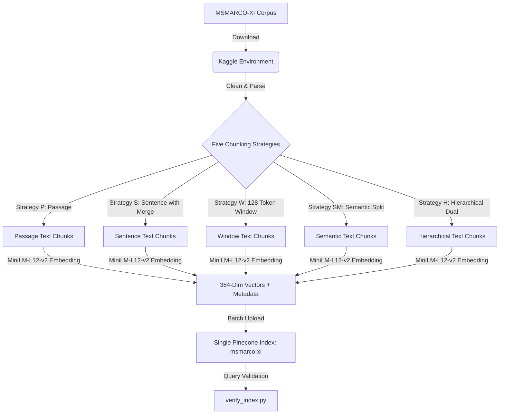
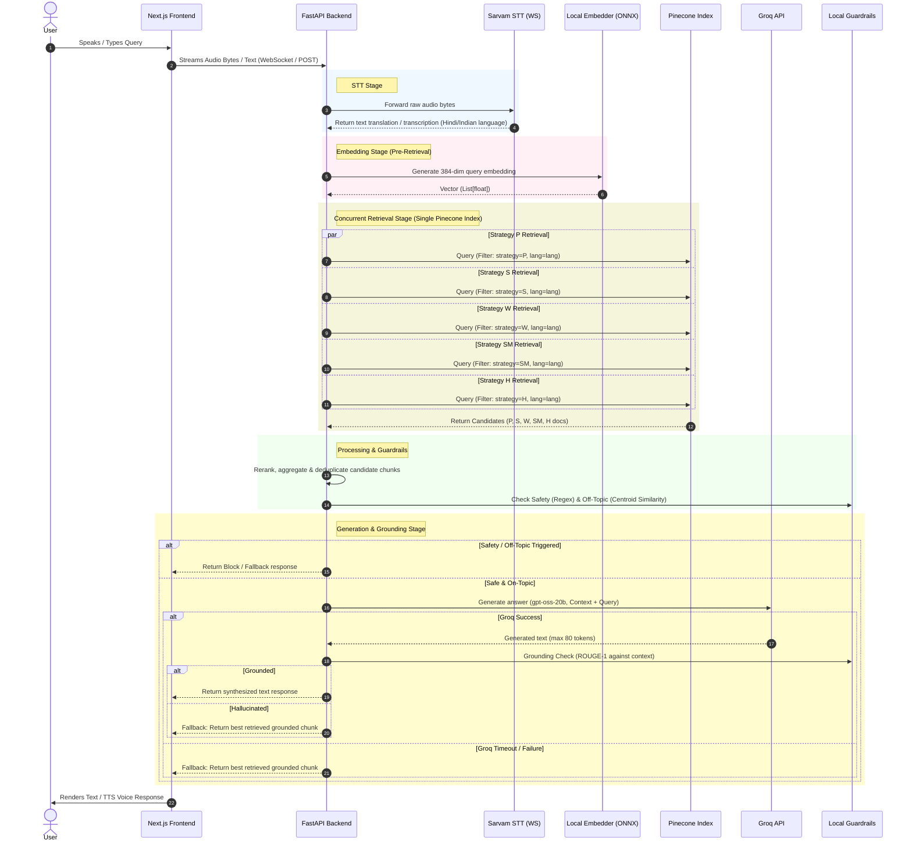

# System Data-Flow Document (USER_FLOW.md)

This document describes the complete data-flow architecture of the Voice RAG system. It is divided into two separate sections:
1. **Offline Indexing Flow**: Preparing, chunking, embedding, and uploading the corpus.
2. **Online Runtime Query Flow**: The low-latency, real-time voice-to-response loop.

---

## OFFLINE INDEXING FLOW

The Offline Indexing Flow is executed as a pre-computation batch step. Its goal is to ingest the MSMARCO-XI dataset, process it using five distinct text splitting strategies, generate multilingual embeddings, and build the persistent index.



### OFFLINE INDEXING PIPELINE SPECIFICATIONS

#### 1. Dataset Acquisition
* **Input Data**: Raw MSMARCO-XI corpus.
* **Output Data**: Raw TSV/JSON records downloaded into the execution environment.
* **Component Responsible**: Kaggle Environment & Indexer Notebook (`indexing/kaggle_indexer.ipynb`).
* **API Boundary**: Kaggle Dataset API / Web Request to Kaggle storage.
* **Data Format**: Compressed archive containing raw text documents.
* **Security-Sensitive Data Boundary**: Kaggle authentication credentials.

#### 2. Data Cleaning
* **Input Data**: Raw text records.
* **Output Data**: Cleaned plain-text entries (invalid characters filtered, malformed lines discarded).
* **Component Responsible**: Cleaning utility function inside `kaggle_indexer.ipynb`.
* **API Boundary**: Local memory / notebook execution boundary.
* **Data Format**: Python strings / pandas DataFrames.

#### 3. Five Chunking Strategies
* **Input Data**: Cleaned document text.
* **Output Data**: Sets of text chunks labeled with their corresponding strategy tag.
* **Component Responsible**: `backend/pipeline/chunker.py` ([chunker.py](file:///d:/HACKATHONS/HHGOA/TASK2/hhg-voice-RAG-model/msmarco-xi-rag/backend/pipeline/chunker.py)) executing in batch environment.
* **API Boundary**: In-memory function calls.
* **Chunking Strategies**:
  * **Strategy P (Passage-level)**: Default passage partitions.
  * **Strategy S (Sentence-level)**: Split by sentences. If a sentence has <10 words, it is merged upwards with the preceding sentence to maintain contextual richness.
  * **Strategy W (Fixed Window)**: Sliding window of 128 tokens with a 32-token overlap.
  * **Strategy SM (Semantic Splitting)**: Sentences split by calculating cosine similarity of consecutive sentence embeddings; boundaries are created where similarity drops below `0.75`.
  * **Strategy H (Hierarchical Dual)**: Outputs the full passage alongside a generated one-line summary.
* **Data Format**: List of dictionaries containing `text`, `doc_id`, `strategy`, and `language`.

#### 4. Embedding Generation
* **Input Data**: Text chunks.
* **Output Data**: 384-dimensional floating-point vectors.
* **Component Responsible**: SentenceTransformers model `paraphrase-multilingual-MiniLM-L12-v2`.
* **API Boundary**: Local GPU/CPU tensor calculations.
* **Vector Dimensions**: 384 dimensions.
* **Language Code**: Multilingual support, including English and Indian languages (hi, ta, te, mr, etc.).
* **Data Format**: List of floats (`List[float]`).

#### 5. Pinecone Index Upload
* **Input Data**: 384-dimensional vectors combined with metadata.
* **Output Data**: Confirmation payload from Pinecone API.
* **Component Responsible**: Pinecone Python Client inside `kaggle_indexer.ipynb`.
* **API Boundary**: Network call to Pinecone REST API.
* **Metadata Schema**:
  ```json
  {
    "doc_id": "string",
    "strategy": "P | S | W | SM | H",
    "language": "string (e.g., 'hi')",
    "text": "string"
  }
  ```
* **Security-Sensitive Data Boundary**: `PINECONE_API_KEY` transmitted over HTTPS.

#### 6. Index Verification
* **Input Data**: Query payloads targeting index.
* **Output Data**: Console log stating vector count, dimensionality, and index configuration.
* **Component Responsible**: `indexing/verify_index.py` ([verify_index.py](file:///d:/HACKATHONS/HHGOA/TASK2/hhg-voice-RAG-model/msmarco-xi-rag/indexing/verify_index.py)).
* **API Boundary**: HTTPS communication with Pinecone service index stats endpoint.

---

## ONLINE RUNTIME QUERY FLOW

The Online Runtime Query Flow is the active path traversed during user interaction. It has a target latency budget of **190ms (from audio capture to the first token generated)**.



### ONLINE RUNTIME FLOW STEP-BY-STEP DETAILS

#### 1. Audio Capture & Submission
* **Input Data**: Physical microphone speech signals.
* **Output Data**: Raw audio bytes (PCM/WAV, sample rate matching specifications).
* **Component Responsible**: Next.js 14 Frontend Web Client.
* **API Boundary**: Browser Web Audio API boundary.
* **Data Format**: Binary raw audio payload.
* **Latency Clock**: Part of the client-side acquisition latency. Not included in backend pipeline clock.

#### 2. Speech-To-Text (STT)
* **Input Data**: Streaming raw audio bytes.
* **Output Data**: Transcribed text string.
* **Component Responsible**: `backend/pipeline/stt.py` ([stt.py](file:///d:/HACKATHONS/HHGOA/TASK2/hhg-voice-RAG-model/msmarco-xi-rag/backend/pipeline/stt.py)) connecting to Sarvam Saaras v3.
* **API Boundary**: WebSocket connection to Sarvam API endpoints.
* **Language Code**: Mapped language identifiers (e.g. `hi-IN` for Hindi, `ta-IN` for Tamil, etc.).
* **Error/Fallback Path**: If WebSocket connection fails, falls back to text input interface prompting user to re-record or type.

#### 3. Query Embedding (Pre-Retrieval)
* **Input Data**: Transcribed query text string.
* **Output Data**: 384-dimensional query vector (`List[float]`).
* **Component Responsible**: `backend/pipeline/embedder.py` ([embedder.py](file:///d:/HACKATHONS/HHGOA/TASK2/hhg-voice-RAG-model/msmarco-xi-rag/backend/pipeline/embedder.py)) loading `paraphrase-multilingual-MiniLM-L12-v2` via ONNX.
* **API Boundary**: Local process CPU memory boundary.
* **Vector Dimensions**: 384 float dimensions.
* **Error/Fallback Path**: Local failure defaults to a fallback sentence-encoder or error response (extremely rare as it runs locally without networking).

#### 4. Concurrent Pinecone Retrieval
* **Input Data**: 384-dimensional query vector.
* **Output Data**: Merged candidate dictionary containing lists of matching documents from the 5 strategies.
* **Component Responsible**: `backend/pipeline/retriever.py` ([retriever.py](file:///d:/HACKATHONS/HHGOA/TASK2/hhg-voice-RAG-model/msmarco-xi-rag/backend/pipeline/retriever.py)).
* **API Boundary**: Concurrently dispatched HTTPS queries to the Pinecone index.
* **Concurrency Points**: Dispatched in parallel using Python's `asyncio.gather` for:
  1. `strategy: P`
  2. `strategy: S`
  3. `strategy: W`
  4. `strategy: SM`
  5. `strategy: H`
* **Metadata Filters Applied**: `{"language": lang, "strategy": strategy}`.
* **Error/Fallback Path**: Timeout on any single connection returns empty result for that branch, merging the remaining successful branches. If all fail, system raises a retrieval exception.

#### 5. Reranking & Aggregation
* **Input Data**: Unsorted dictionary of list of candidates.
* **Output Data**: Ranked and deduplicated flat list of candidate documents.
* **Component Responsible**: Python helper routines in `backend/pipeline/retriever.py`.
* **API Boundary**: In-process memory.

#### 6. Guardrails (Safety & Off-Topic)
* **Input Data**: Query string and Query embedding.
* **Output Data**: Boolean flags indicating safety and topic validity.
* **Component Responsible**: `backend/guardrails/safety.py` ([safety.py](file:///d:/HACKATHONS/HHGOA/TASK2/hhg-voice-RAG-model/msmarco-xi-rag/backend/guardrails/safety.py)) & `backend/guardrails/off_topic.py` ([off_topic.py](file:///d:/HACKATHONS/HHGOA/TASK2/hhg-voice-RAG-model/msmarco-xi-rag/backend/guardrails/off_topic.py)).
* **API Boundary**: Local python executions.
* **Fallback Paths**:
  * If safety fails, return: `"Unsafe query blocked."`
  * If off-topic similarity to corpus centroid is below threshold, return: `"Off-topic query blocked."`

#### 7. Generation via Groq
* **Input Data**: Prompt containing system prompt, query string, and selected context chunks.
* **Output Data**: Generated response string.
* **Component Responsible**: `backend/pipeline/generator.py` ([generator.py](file:///d:/HACKATHONS/HHGOA/TASK2/hhg-voice-RAG-model/msmarco-xi-rag/backend/pipeline/generator.py)) interacting with Groq.
* **API Boundary**: HTTPS POST to `api.groq.com/openai/v1/chat/completions`.
* **Model**: `openai/gpt-oss-20b` (or equivalent high-performance endpoint).
* **Generation Constraints**: Maximum limit of 80 tokens.
* **Error/Fallback Path**: If Groq API fails or times out, the flow directly falls back to the **best retrieved grounded chunk** (top-ranked search result). There is **no second cloud LLM fallback** in this path.

#### 8. Grounding Guardrail
* **Input Data**: Generated response text and context chunks.
* **Output Data**: Boolean flag indicating if the response is grounded.
* **Component Responsible**: `backend/guardrails/grounding.py` ([grounding.py](file:///d:/HACKATHONS/HHGOA/TASK2/hhg-voice-RAG-model/msmarco-xi-rag/backend/guardrails/grounding.py)).
* **API Boundary**: In-process local execution.
* **Strategy**: Local ROUGE-1 overlap metrics check.
* **Fallback Path**: If ROUGE-1 score is below target threshold (hallucination detected), discard LLM response and return the **best retrieved grounded chunk** as fallback.

#### 9. Response Delivery
* **Input Data**: Validated response string.
* **Output Data**: JSON packet payload.
* **Component Responsible**: FastAPI main application routers.
* **API Boundary**: Network response over HTTP/WebSockets back to Next.js.

---

## STRICT ARCHITECTURAL CONSTRAINTS

To maintain performance, reliability, and security, the system adheres to the following rules:

> [!IMPORTANT]
> 1. **Runtime Isolation from MSMARCO-XI**: The runtime application never loads or refers to the raw MSMARCO-XI dataset. All reference material resides inside the indexed vectors.
> 2. **No Runtime Chunking**: Document chunking is strictly an offline pre-computation task. The runtime never splits or chunks any documents.
> 3. **No Runtime Document Embedding**: The runtime never embeds corpus documents. It only embeds the user's incoming query text.
> 4. **Query Embedding Order**: Query embedding is generated **before** querying Pinecone, as the vector is required for Pinecone similarity matching.
> 5. **Concurrent Strategy Queries**: All 5 chunking strategy queries run **concurrently in parallel** to prevent sequential network bottlenecks.
> 6. **Single Pinecone Index**: Exactly **one Pinecone index** (`msmarco-xi`) is used to store all five chunking strategies.
> 7. **Metadata Segmentation**: Differentiating between chunking strategies is handled via the `strategy` metadata field inside the index.
> 8. **No Secondary LLM Fallbacks**: The critical generation path uses Groq. There is **no secondary LLM fallback** (e.g. OpenAI or Anthropic) in order to avoid piling up API call delays.
> 9. **LLM Failure Fallback**: If the LLM call fails, times out, or fails grounding, the system immediately returns the **best retrieved grounded chunk** text as the response.
> 10. **Published Latency Measurement**: The final published system latency is measured directly on the deployed Render instance to reflect real network and compute speeds.
